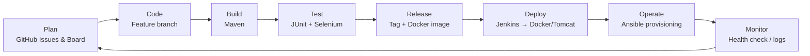
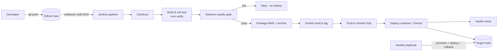

# Week 2 – Agile Planning and DevOps Workflow

Methodology: **Scrum-ban** – 7 two-week sprints (+ final week) tracked on a Kanban board
(GitHub Projects: *Backlog → To Do → In Progress → Review → Done*).

## 1. User stories and acceptance criteria

| ID | User story | Acceptance criteria | Priority | Points |
|----|-----------|---------------------|----------|--------|
| VSS-1 | As a **volunteer** I want to **register with my name, e-mail, phone and skills** so that coordinators know who I am. | 1. Valid data → "Registration successful". 2. Missing/invalid e-mail → validation message. 3. Already registered e-mail → error "already registered". | Must | 3 |
| VSS-2 | As a **volunteer** I want to **see all upcoming slots with remaining seats** so that I can choose one. | 1. List shows title, event, location, date, time, seats left. 2. Full slots show "Full" and cannot be booked. | Must | 3 |
| VSS-3 | As a **volunteer** I want to **request a booking for a slot** so that I can reserve my place. | 1. Registered e-mail → booking created with status PENDING and reference `VSS-XXXXXX`. 2. Unregistered e-mail → error. 3. Same volunteer cannot hold two active bookings for one slot. 4. Capacity never exceeded. | Must | 5 |
| VSS-4 | As a **coordinator** I want to **confirm pending bookings** so that volunteers know they are expected. | 1. Dashboard lists all bookings. 2. Confirm changes PENDING → CONFIRMED. 3. Cancelled bookings cannot be confirmed. | Must | 3 |
| VSS-5 | As a **volunteer/coordinator** I want to **cancel a booking** so that the seat is released. | 1. Status → CANCELLED. 2. Seats left increases by 1. 3. Cancelling twice shows an error. | Must | 3 |
| VSS-6 | As a **volunteer** I want to **track my booking status** by reference or e-mail so I don't have to call the coordinator. | 1. Valid reference shows booking details + status. 2. Unknown reference → "not found". 3. E-mail lists all my bookings. | Must | 3 |
| VSS-7 | As a **DevOps engineer** I want a **health and version endpoint** so pipelines can verify deployments. | `/actuator/health` returns UP, `/api/version` returns version + environment. | Must | 1 |
| VSS-8 | As a **DevOps engineer** I want **every commit built and tested by Jenkins** so defects are caught early. | Jenkinsfile with checkout, build, test, package, deploy; triggered by SCM polling/webhook. | Must | 5 |
| VSS-9 | As a **QA engineer** I want **Selenium tests for critical journeys** that block deployment on failure. | ≥5 journeys, screenshots on failure, JUnit report in Jenkins. | Must | 5 |
| VSS-10 | As a **DevOps engineer** I want the app **containerised and deployed automatically**. | Versioned image pushed to registry; fresh container after green tests. | Must | 5 |
| VSS-11 | As a **DevOps engineer** I want **servers provisioned by Ansible** idempotently with rollback. | Playbook installs prerequisites, deploys container, health check, rollback playbook. | Must | 5 |
| VSS-12 | As a **coordinator** I want **REST APIs** for slots and bookings for future integrations. | JSON CRUD-style endpoints documented in API list. | Should | 3 |
| VSS-13 | As a coordinator I want login & roles | — (future) | Could | 8 |
| VSS-14 | As a volunteer I want e-mail notifications | — (future) | Could | 5 |

## 2. Product backlog (ordered)
VSS-1, VSS-2, VSS-3, VSS-4, VSS-5, VSS-6, VSS-7, VSS-12, VSS-8, VSS-9, VSS-10, VSS-11,
then future items VSS-13, VSS-14.

## 3. 15-week sprint plan

| Sprint | Weeks | Goal | Backlog items | Course deliverable |
|--------|-------|------|---------------|--------------------|
| 0 | 1–2 | Inception & planning | – | Problem statement, backlog, DoD, workflow |
| 1 | 3–4 | Architecture & repository | VSS-7 (skeleton) | SRS, diagrams, GitHub repo |
| 2 | 5–6 | MVP features | VSS-1 … VSS-6, VSS-12 | Feature branches, PR, conflict, tag v1.0.0 |
| 3 | 7–8 | Continuous integration & deployment | VSS-8 | Jenkins job, Jenkinsfile, Tomcat deploy |
| 4 | 9–10 | Continuous testing | VSS-9 | Selenium suite, quality gate, defect fix |
| 5 | 11–12 | Containerisation & CD | VSS-10 | Dockerfile, registry, auto deploy |
| 6 | 13–14 | Configuration management & reliability | VSS-11 | Ansible playbook, idempotency, rollback |
| 7 | 15 | Release & viva | all | Final report, demo, presentation |

## 4. Task board (Kanban snapshot – end of project)

| Backlog | To Do | In Progress | Review | Done |
|---------|-------|-------------|--------|------|
| VSS-13 Login & roles | | | | VSS-1 … VSS-12 |
| VSS-14 Notifications | | | | |

*Columns used during the project:* **Backlog → To Do (sprint) → In Progress (WIP limit 2) → Review (PR open) → Done (merged + pipeline green).**
Create it in GitHub: *Projects → New project → Board*, add the issues created from the templates in `.github/ISSUE_TEMPLATE`.

## 5. Definition of Done
A backlog item is **Done** only when:
1. Code is written on a correctly named branch and follows project conventions.
2. Unit/integration tests are written and `mvn clean verify` passes.
3. UI changes are covered by a Selenium journey and `mvn test -Pselenium` passes.
4. A pull request is reviewed and approved by at least one reviewer and merged into `develop`.
5. The Jenkins pipeline is green (build → test → Selenium gate → package → Docker → deploy).
6. The application is deployed and `/actuator/health` returns `UP`.
7. Acceptance criteria are demonstrated and documentation (README/docs) is updated.
8. No open critical/high bugs for the item.

## 6. DevOps lifecycle workflow

