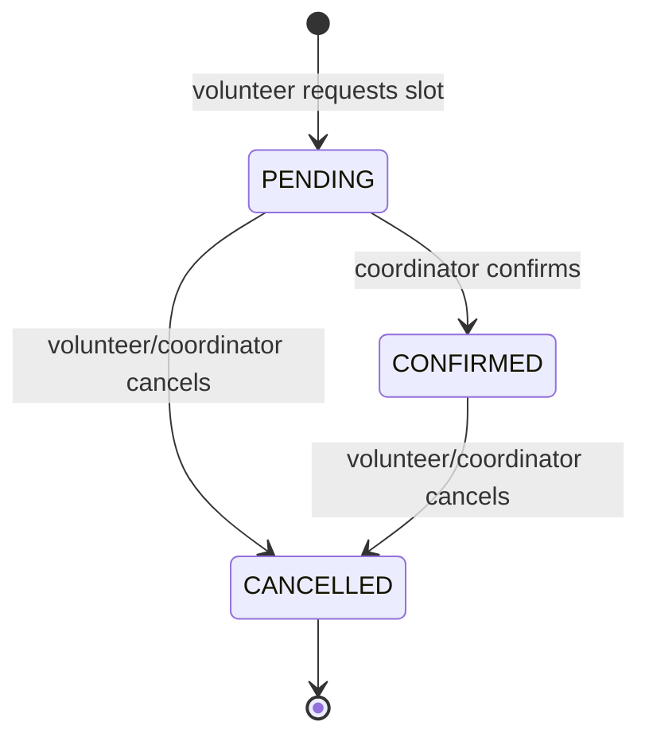
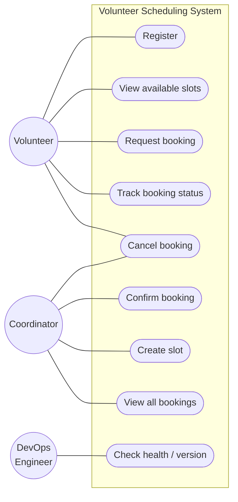
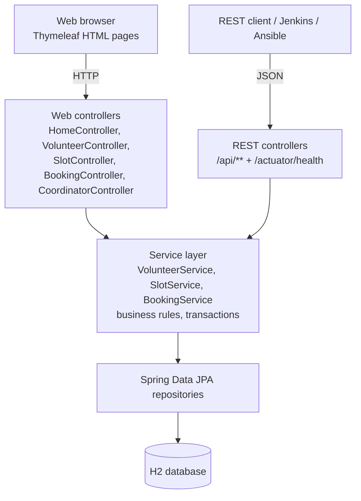
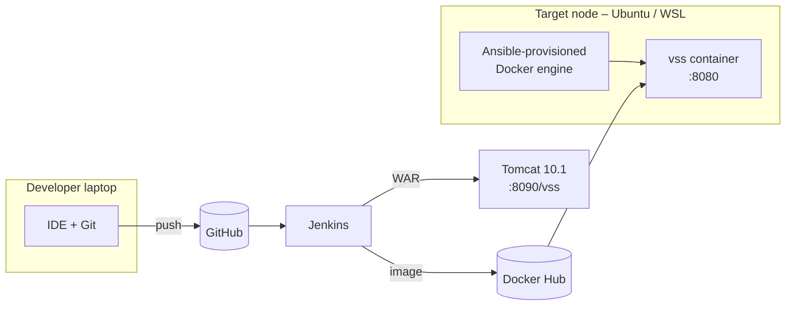
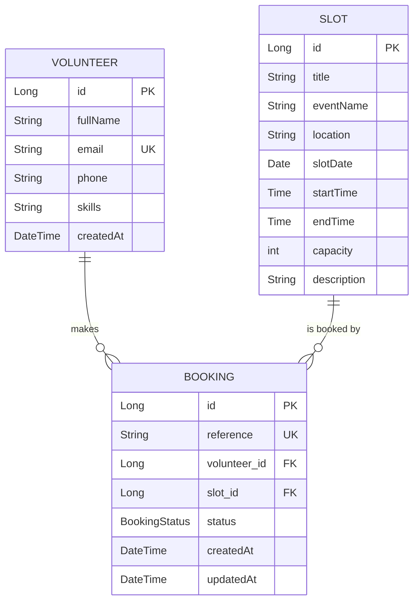

# Week 3 – Requirements, Architecture and Technology Setup

## 1. SRS summary

### 1.1 Purpose
Define the requirements of the Volunteer Scheduling System (VSS) MVP.

### 1.2 Functional requirements
| ID | Requirement |
|----|-------------|
| FR-1 | The system shall let a volunteer register with name, e-mail (unique), phone and skills. |
| FR-2 | The system shall list upcoming slots (shifts) with title, event, location, date, start/end time, capacity and seats left. |
| FR-3 | The system shall let a registered volunteer request a booking for a slot that has free seats; the booking gets status `PENDING` and a unique reference `VSS-XXXXXX`. |
| FR-4 | The system shall prevent duplicate active bookings (same volunteer + slot) and over-booking (active bookings ≤ capacity). |
| FR-5 | The system shall let a coordinator confirm a `PENDING` booking (→ `CONFIRMED`). |
| FR-6 | The system shall let a volunteer or coordinator cancel a `PENDING`/`CONFIRMED` booking (→ `CANCELLED`), releasing the seat. |
| FR-7 | The system shall show booking status by reference number or list all bookings for an e-mail. |
| FR-8 | The system shall let a coordinator create new slots. |
| FR-9 | The system shall expose REST APIs and a health endpoint. |

### 1.3 Non-functional requirements
| ID | Category | Requirement |
|----|----------|-------------|
| NFR-1 | Performance | Pages respond in < 1 s for 100 concurrent users on a laptop-class server |
| NFR-2 | Availability | Health endpoint `/actuator/health`; container restarts automatically (`--restart unless-stopped`) |
| NFR-3 | Portability | Runs as WAR on Tomcat 10.1 **or** as Docker container on any Linux host |
| NFR-4 | Maintainability | Layered architecture, ≥ 1 automated test per feature, conventional commits |
| NFR-5 | Configurability | Environment (`APP_ENV`), port, DB URL configurable via environment variables |
| NFR-6 | Usability | Simple responsive HTML UI, clear success/error messages |
| NFR-7 | Data integrity | Server-side validation; capacity rule enforced in service layer inside a transaction |

### 1.4 Booking status life-cycle


## 2. Use-case diagram


## 3. Architecture

### 3.1 Application architecture (layered MVC)


### 3.2 Deployment architecture


## 4. Data model


## 5. Endpoint / API list

### 5.1 Web (HTML) endpoints
| Method | Path | Purpose |
|--------|------|---------|
| GET | `/` | Home page |
| GET/POST | `/register` | Volunteer registration form |
| GET | `/slots` | Availability / slot view |
| GET/POST | `/slots/{id}/book` | Booking request form |
| GET | `/status?ref=&email=` | Booking status tracking |
| POST | `/bookings/{ref}/cancel` | Volunteer cancels a booking |
| GET | `/coordinator` | Coordinator dashboard (all bookings, create slot) |
| POST | `/coordinator/bookings/{ref}/confirm` | Confirm booking |
| POST | `/coordinator/bookings/{ref}/cancel` | Cancel booking |
| POST | `/coordinator/slots` | Create slot |

### 5.2 REST API (JSON)
| Method | Path | Body / params | Response |
|--------|------|---------------|----------|
| GET | `/api/volunteers` | – | list of volunteers |
| POST | `/api/volunteers` | `{fullName,email,phone,skills}` | 201 volunteer / 409 duplicate |
| GET | `/api/slots` | – | slots with `seatsLeft` |
| POST | `/api/slots` | slot JSON | 201 slot |
| GET | `/api/bookings` | `?email=` optional | list of bookings |
| POST | `/api/bookings` | `{email, slotId}` | 201 booking (PENDING) |
| GET | `/api/bookings/{ref}` | – | booking / 404 |
| PUT | `/api/bookings/{ref}/confirm` | – | booking (CONFIRMED) |
| PUT | `/api/bookings/{ref}/cancel` | – | booking (CANCELLED) |
| GET | `/api/version` | – | name, version, environment |
| GET | `/actuator/health` | – | `{"status":"UP"}` |

## 6. Technology selection
| Concern | Selected | Reason |
|---------|----------|--------|
| Language / framework | Java 17, Spring Boot 3.3 | Industry standard, quick MVC + REST, embedded server |
| UI | Thymeleaf server-side templates | No separate front-end build, Selenium-friendly element IDs |
| Build tool | **Maven 3.9** | Required by course, standard lifecycle, Jenkins integration |
| Database | H2 (embedded) | Zero install; swap to MySQL/PostgreSQL via `DB_URL` |
| Testing | JUnit 5, Spring MockMvc, **Selenium WebDriver 4** | Unit/integration + browser UI tests |
| Deployment target | **Apache Tomcat 10.1** (WAR) and Docker (embedded Tomcat) | Packaging as executable WAR supports both |
| CI/CD | Jenkins (Pipeline as Code) | Course requirement |
| Container | Docker, Docker Hub | Course requirement |
| Configuration management | **Ansible** | Agentless, YAML, works from WSL |

## 7. Local development setup
| Tool | Version used |
|------|-------------|
| JDK | 17 or 21 (`JAVA_HOME` set) |
| Maven | 3.9.x |
| Git | 2.46 |
| Browser (Selenium) | Microsoft Edge / Google Chrome (driver auto-downloaded by Selenium Manager) |
| IDE | IntelliJ IDEA / VS Code |
| Optional | Docker Desktop, Jenkins LTS, WSL Ubuntu + Ansible |

```bash
git clone https://github.com/<your-user>/volunteer-scheduling-system.git
cd volunteer-scheduling-system
mvn clean verify                 # compile + unit/integration tests + package target/vss.war
java -jar target/vss.war         # open http://localhost:8080
# or: mvn spring-boot:run
```
Verification: `curl http://localhost:8080/actuator/health` → `{"status":"UP",...}`
